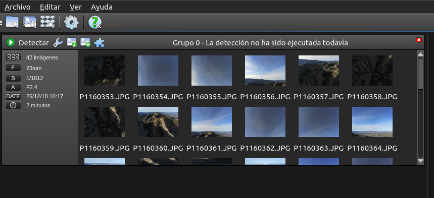
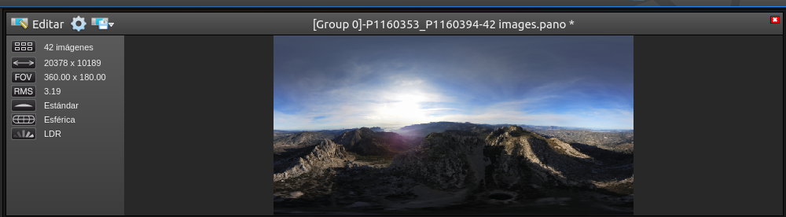
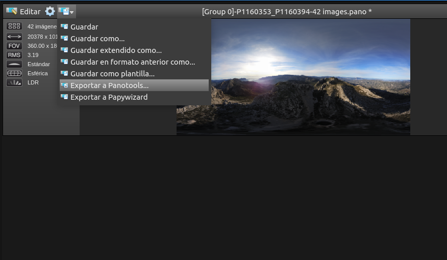
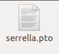
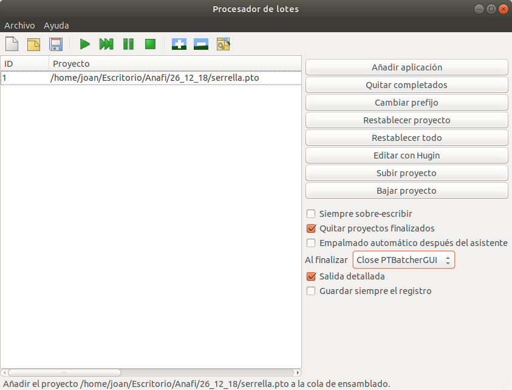
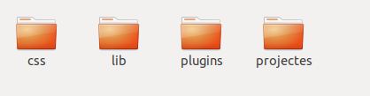

Estuve mucho tiempo teniendo en mi cabeza la posibilidad de hacer 360 fotos, para una biblioteca personal, quizás un trabajo, y por supuesto, ¡porque tengo un Parrot Anafi!

Después de mi investigación, donde estaban mis ideas principales:
- ¿Qué software necesitaría?
- Fuente abierta / o gratuita.
- Buenos resultados sobre el picado y la calidad en la foto final.
- ¿Próximo? Como por ejemplo las visitas virtuales.

Entonces, estos fueron los programas que revisé:
* [Stitch Panorama: a GIMP Plug-in](http://stitchpanorama.sourceforge.net/)
* [Hugin](http://hugin.sourceforge.net/)
* [Pandora: a GIMP Plugin for Making Panoramas](http://www.shallowsky.com/software/pandora/)
* [/gopro-fusion-studio](https://es.shop.gopro.com/EMEA/softwareandapp/gopro-fusion-studio-app/fusion-studio.html)
* [panotools](https://wiki.panotools.org/Main_Page)
* [ForgeJS](https://forgejs.org/)
* [Panotour Viewer](https://www.kolor.com/panotour-viewer-download/)
* [Gigapan](http://www.gigapan.com/cms/support/download-gigapan-stitch)
* [PTGui](https://www.ptgui.com/)
* [PTsticherNG](https://webuser.hs-furtwangen.de/~dersch/PTStitcherNG/PTStitcherNG0.4.html)
* [Panellum](https://pannellum.org/)

La mejor opción de código abierto fue Hugin, por supuesto, pero ese software tiene un pequeño problema cuando quieres ir rápido, no gastar demasiado tiempo o porque eres un vago. El problema es que la mayoría de las veces tienes que poner el control. puntos, aburrido no?

Entonces, yo estaba revisando el software comercial. Parece que una de las mejores opciones es Autopano, pero también tiene un problema ... ¿Por qué siempre tengo problemas? El problema es que no es gratis, y desde 2018 no se mantendrá.

¡¡Pero hay una solución!!

Autopano, en su versión gratuita puede alinear las imágenes, y es REALMENTE BUENO hacer esto, ¡incluso puede exportar la alineación en el formato de Hugin!

Entonces solo tiene que exportar el formato hugin y procesar la foto 360 en Hugin sin perder resolución.

Después de crear la fotosfera, el siguiente paso es publicar o compartir su imagen, pero no encontré un repositorio de código abierto ... Entonces, podemos crear nuestro propio repositorio :), ¿cómo? Con la ayuda de Github o Gitlab.

Luego, podemos usar el siguiente software y cargarlo a Github: [ForgeJS] (https://forgejs.org), que solo tenemos que descargar, seleccionar el tipo de proyecto que queremos y luego cambiar el código del *config.json* en algunos de los proyectos de la carpeta */samples/projects/*.

Tomé la carpeta simple_project y este es el resultado:

- [Serrella](../static/360/projectes/serrella/index.html)
- [Castellet](../static/360/projectes/castellet/index.html)
- [Polop](../static/360/projectes/polop/index.html)

Y esto, los archivos que subo a Github:

You can check the project [here](https://github.com/JoanCano/joancano.io/tree/master/_site/360)
