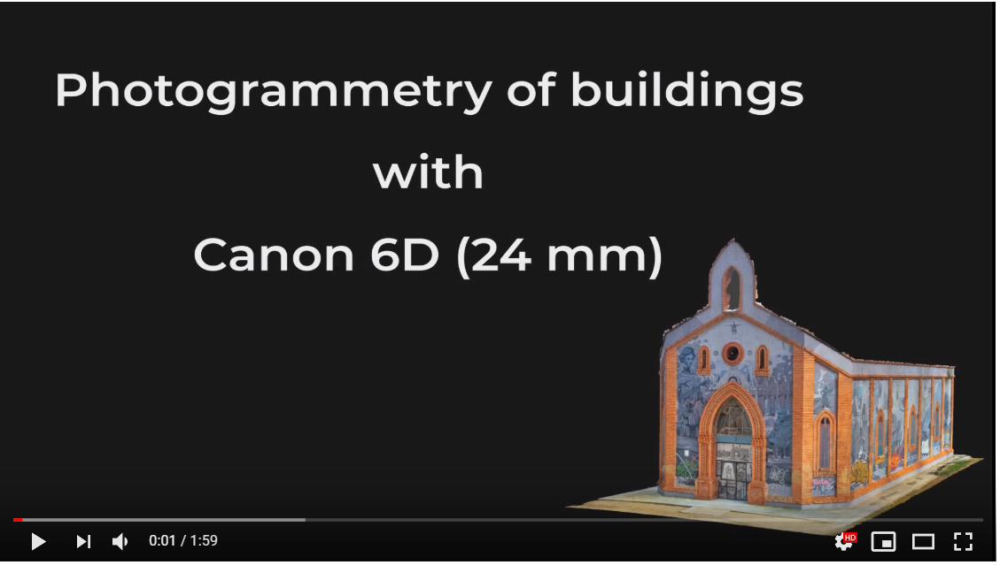
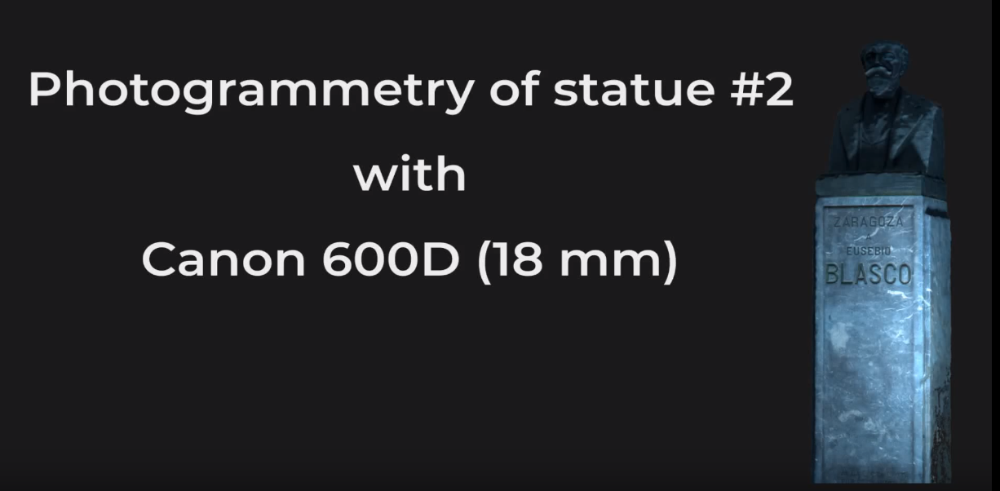

Uno de los proyectos que vengo realizando desde hace unos meses es la creación de modelos 3D por fotogrametría.
Los siguientes vídeos y visualizadores son algunos de los modelos que he hecho. No son proyectos profesionales, tan solo el resultado de pruebas que hago para saber cómo funcionan según que procesos realizo, desde la toma de datos al postproceso.

**Photogrammetry of a pine cone with Agisoft**

**Photogrammetry examples. Buildings #1**

**Photogrammetry examples. Statue #2**

**Photogrammetry examples. Building wall with Canon 600D**

**Photogrammetry of statue with agisoft and Canon 600D (18 mm)**

<!-- blank line -->
<figure class="video_container">
  <iframe src="https://www.youtube.com/watch?v=GiyiEjxY1E4" frameborder="0" allowfullscreen="true"> </iframe>
</figure>
<!-- blank line -->

## Modelos en Sketchfab

<iframe width="640" height="480" src="https://sketchfab.com/models/77cd6a4feca1483ab9ec067c89bba691/embed" frameborder="0" allow="autoplay; fullscreen; vr" mozallowfullscreen="true" webkitallowfullscreen="true"></iframe>

    <a href="https://sketchfab.com/3d-models/pine-cone-77cd6a4feca1483ab9ec067c89bba691?utm_medium=embed&utm_source=website&utm_campaign=share-popup" target="_blank" style="font-weight: bold; color: #1CAAD9;">Pine cone</a>
    by <a href="https://sketchfab.com/joancalad?utm_medium=embed&utm_source=website&utm_campaign=share-popup" target="_blank" style="font-weight: bold; color: #1CAAD9;">joancalad</a>
    on <a href="https://sketchfab.com?utm_medium=embed&utm_source=website&utm_campaign=share-popup" target="_blank" style="font-weight: bold; color: #1CAAD9;">Sketchfab</a>

<iframe width="640" height="480" src="https://sketchfab.com/models/fd0a70c41b5d4d018d1fe31dda50f8f4/embed" frameborder="0" allow="autoplay; fullscreen; vr" mozallowfullscreen="true" webkitallowfullscreen="true"></iframe>

    <a href="https://sketchfab.com/3d-models/human-hand-fd0a70c41b5d4d018d1fe31dda50f8f4?utm_medium=embed&utm_source=website&utm_campaign=share-popup" target="_blank" style="font-weight: bold; color: #1CAAD9;">Human hand</a>
    by <a href="https://sketchfab.com/joancalad?utm_medium=embed&utm_source=website&utm_campaign=share-popup" target="_blank" style="font-weight: bold; color: #1CAAD9;">joancalad</a>
    on <a href="https://sketchfab.com?utm_medium=embed&utm_source=website&utm_campaign=share-popup" target="_blank" style="font-weight: bold; color: #1CAAD9;">Sketchfab</a>

<iframe width="640" height="480" src="https://sketchfab.com/models/10a49cabb367453c9153e0689a7b2f28/embed" frameborder="0" allow="autoplay; fullscreen; vr" mozallowfullscreen="true" webkitallowfullscreen="true"></iframe>

    <a href="https://sketchfab.com/3d-models/agustina-zaragoza-10a49cabb367453c9153e0689a7b2f28?utm_medium=embed&utm_source=website&utm_campaign=share-popup" target="_blank" style="font-weight: bold; color: #1CAAD9;">Agustina Zaragoza</a>
    by <a href="https://sketchfab.com/joancalad?utm_medium=embed&utm_source=website&utm_campaign=share-popup" target="_blank" style="font-weight: bold; color: #1CAAD9;">joancalad</a>
    on <a href="https://sketchfab.com?utm_medium=embed&utm_source=website&utm_campaign=share-popup" target="_blank" style="font-weight: bold; color: #1CAAD9;">Sketchfab</a>

